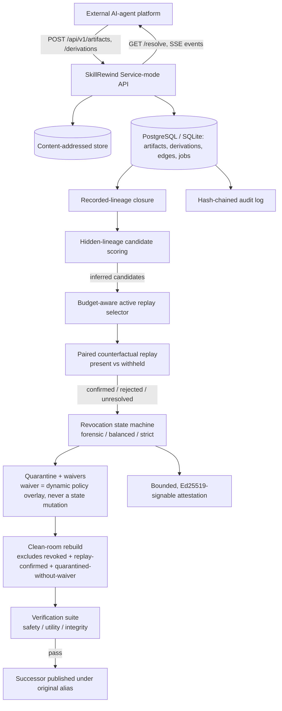

# SkillRewind

**Traceable, revocable, and rebuildable persistent learning for AI agents.**

> AI agents can learn reusable skills, memories, and other persistent artifacts. SkillRewind is an open-source
> research and infrastructure project that makes those artifacts attributable, revocable, selectively
> rebuildable, and verifiable within a declared evidence boundary — as a platform-agnostic service any agent
> platform can integrate with over a documented HTTP API.

[](#current-status)
[](LICENSE)

## Current status

**v0.3.0a1, research and integration preview.** This release adds a real Service-mode HTTP API (FastAPI +
SQLAlchemy + Alembic + a durable job worker) on top of the tested Lite-mode CLI/library core from v0.2, and
freezes a versioned public integration contract:

- `docs/integration-contract-v1.md` — the six integration responsibilities and three Integration Levels
  (Audit / Enforcement / Full Rewind) an external platform can build against.
- `docs/api-stability-v1.md` — every `/api/v1` endpoint categorized `stable-v1` / `experimental-v1` / `internal`,
  with explicit compatibility rules.
- `docs/openapi-v1.json` — generated from the real, live FastAPI app (`make openapi`), never hand-written.
- `docs/event-contract-v1.md` — the canonical event envelope for SSE/webhooks/message buses.
- `skillrewind conformance describe` / `skillrewind conformance self-test` — machine-readable contract
  requirements, and a local proof that this repository's own API satisfies its own contract.

See `docs/release-readiness-v0.3.md` for the full, honest component-by-component status (complete / partial /
blocked / not-started, with evidence and blockers for each) and `docs/threat-model.md` /`SECURITY.md` for the
trust-boundary analysis.

## NOT YET

- **Universal model unlearning or foundation-model weight erasure.** SkillRewind revokes/rebuilds *artifacts*
  in its own store; every attestation states explicitly that it makes no claim about a foundation model's
  parameters. See `docs/threat-model.md`.
- **Guaranteed causal attribution.** `inferred`-evidence-class edges come from explainable static scoring, not
  proof; only `replay-confirmed` edges have been tested via a controlled intervention, and that is bounded by
  the declared replay boundary.
- **Automatic compatibility with every AI platform.** Integration requires a platform to implement the relevant
  responsibilities in `docs/integration-contract-v1.md` for its target Integration Level; there is no
  zero-config auto-discovery.
- **A production-ready arbitrary-code replay sandbox.** The only two replay runners are an in-process
  deterministic-fixture runner and a subprocess runner with resource limits but no network-namespace isolation.
  See `docs/threat-model.md`.

## The problem

Self-evolving agents can distill trajectories, memories, tool interactions, and documents into persistent
skills. Deleting a poisoned or obsolete source does not necessarily remove its effect: later skills may
preserve the behavior after paraphrasing instructions, rewriting code, changing tools, or passing through
multiple generations — and the influence edge back to the source is often never recorded.

> When a skill, memory, trace, prompt patch, or other persistent agent artifact is revoked, deleting the source
> is insufficient if its influence has propagated into descendants whose provenance edges are missing,
> transformed, or incomplete. SkillRewind recovers plausible hidden influence, tests selected relationships
> through counterfactual re-derivation, quarantines confirmed or high-risk descendants, rebuilds them from
> clean support, verifies safety and retained utility, and emits a bounded attestation that clearly
> distinguishes facts, inferences, interventions, and unresolved uncertainty.

## Architecture



Not implemented in this release: a web dashboard, Docker-based replay isolation, packaged SDKs, and live
PostgreSQL validation (schema/migrations are dialect-portable and SQLite-tested; see
`docs/release-readiness-v0.3.md`). Do not infer scope from this diagram alone.

## Integration levels

| Level | Adds | See |
|---|---|---|
| **1 — Audit** | Artifact ingestion, derivation capture, lineage read. SkillRewind analyzes provenance; does not control serving. | `docs/integration-contract-v1.md` |
| **2 — Enforcement** | Resolution gate, quarantine/revocation enforcement. | same |
| **3 — Full Rewind** | Replay, rebuild, verification, successor publication, attestation. | same |

## 5-minute quickstart

```bash
git clone <this-repo> && cd SkillRewind
make bootstrap-service   # uv venv + editable install with dev+service extras
make demo                 # runs the full poisoned-descendant scenario end to end (Lite mode)
```

`make demo` initializes an isolated workspace at `.skillrewind-demo/`, ingests three Agent Skills directories,
recovers a hidden-lineage candidate that recorded closure misses, replay-confirms it, runs a `balanced`
revocation, quarantines the confirmed descendant, rebuilds and verifies a clean successor, republishes it under
the original alias, and writes a signed attestation. Reset it with `make demo-reset`.

### Minimal API example (Service mode)

```bash
skillrewind serve --database-url sqlite:///./service.db --port 8000 &
curl -s -X POST localhost:8000/api/v1/artifacts \
  -H "Authorization: Bearer $API_KEY" \
  --data-binary @my-skill.md \
  -G --data-urlencode kind=agent-skill --data-urlencode logical_name=my-skill

curl -s localhost:8000/api/v1/artifacts/$ARTIFACT_ID/resolve -H "Authorization: Bearer $API_KEY"
```

See `docs/openapi-v1.json` for the full schema and `docs/api-stability-v1.md` for what's safe to build against.

### CLI (Lite mode)

```bash
skillrewind --workspace .skillrewind init
skillrewind --workspace .skillrewind artifact-ingest-skill ./my-skill --alias my-skill
skillrewind --workspace .skillrewind closure --root skill://my-skill@sha256:...
skillrewind --workspace .skillrewind revoke-start --root skill://my-skill@sha256:... \
  --policy balanced --reason "..." --severity high
skillrewind conformance describe
skillrewind conformance self-test
```

Run `skillrewind <command> --help` for full flag lists. v0.1's recorded-only commands remain supported
unchanged (`closure --edges ...`, `attest --edges ...`).

## Evidence classes

SkillRewind never calls correlation causal. Every edge carries one of five evidence classes, and promotion
between them preserves prior evidence rather than erasing it:

1. **recorded** — directly captured as an input or exposure at derivation time.
2. **inferred** — supported by static multi-trace scoring; not causal.
3. **replay-confirmed** — supported by a paired intervention (present vs. withheld) within a declared,
   fully-reconstructed replay boundary.
4. **rejected** — tested but not supported under the declared intervention and probes; not universal proof of
   no influence.
5. **unresolved** — not replayable, inconclusive, outside budget, or outside coverage. A runner failure becomes
   `unresolved`, never `rejected`.

`recorded_descendants()` (the "recorded closure") strictly traverses `recorded`-evidence edges only —
inferred, replay-confirmed, rejected, and unresolved edges never silently expand what a barrier or
serving-resolution decision treats as "recorded." A waiver never promotes evidence between these classes (see
`docs/threat-model.md`).

## Research integrity note

The hidden-lineage candidate scorer's weights are hand-set and provisional, not calibrated against a validated
held-out set. `RewindBench-core`'s benchmark numbers (`make bench-smoke`) are real, reproducible output from
the deterministic generator/harness in this repository, not fabricated figures — but sample sizes below 30
cases are explicitly reported as descriptive-only, and only 3 of the planned 8 scenario families are
implemented. See `docs/release-readiness-v0.3.md` for the exact scope.

## Limitations

See `docs/threat-model.md` for the full breakdown. In short: no arbitrary-code sandboxing for untrusted replay
content, no cross-tenant artifact-content confidentiality beyond scope-based API keys, no PostgreSQL live
validation in this development environment (Docker unavailable — schema/migrations are dialect-portable and
SQLite-tested), and no claim of model unlearning.

## Security note

Do not point any component at production credentials, real infrastructure, or live agent traffic without
further hardening — this is an alpha research/integration preview. See `SECURITY.md` for the vulnerability
reporting process and `docs/threat-model.md` for the full trust-boundary analysis.

## Benchmark status

`make bench-smoke` runs the `smoke` preset (3 deterministic cases) offline in seconds. `static-multitrace` and
`exhaustive-replay` correctly recover the planted hidden descendant with zero false-quarantine of the
strict-negative artifact, while `delete-root` and `recorded-closure` (which cannot see hidden lineage by
construction) score zero recall. The `research`/`paper` presets exist and are runnable but are not part of any
automated gate.

## Citation

A preliminary citation record is provided in [`CITATION.cff`](CITATION.cff). Update it with a DOI or archival
identifier only after publication.

## Contributing

This is an early-stage research and integration preview from a single maintainer. Issues and PRs are welcome;
please run `make ci` before submitting. See `docs/release-readiness-v0.3.md` for what's safe to build on top of
versus what is still in flux.

## License

Apache License 2.0. See [`LICENSE`](LICENSE). Copyright Faisal Ali Said Al-Anqoudi / Nuqta Technologies.
